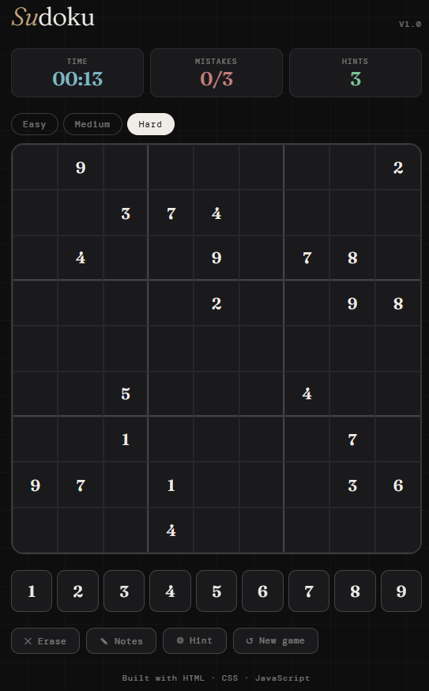

# 🔢 Sudoku

A fully-featured Sudoku game built with vanilla HTML, CSS, and JavaScript — no frameworks, no dependencies.

[](https://rakibulislamnayan.github.io/sudoku-js)
[](https://github.com/rakibulislamnayan/sudoku-js)

---

## ✨ Features

- **3 Difficulty levels**: Easy (36 clues), Medium (28 clues), Hard (22 clues)
- **Puzzle generator**: unique puzzle every game using backtracking algorithm
- **Live timer**: tracks how long you take to complete each puzzle
- **Mistake counter**: Easy 9 attempts, Medium 6 attempts, Hard 3 attempts
- **Hint system**: 3 hints per game to reveal a correct cell
- **Notes mode**: pencil in candidate numbers like a real Sudoku pro
- **Number highlighting**: selected row, column, box and same numbers highlighted
- **Mobile numpad**: tap-friendly number input on any device
- **Keyboard support**: arrow keys to navigate, number keys to input
- **Win & lose animations**: satisfying board flash on completion
- **Zero dependencies**: pure HTML, CSS, JavaScript

---

## 🚀 Live Demo

👉 [Play it here](https://rakibulislamnayan.github.io/sudoku-js)

---

## 📸 Screenshot



---

## 🛠️ Tech Stack

| Technology | Usage |
|---|---|
| HTML5 | Game structure & semantics |
| CSS3 | Styling, grid layout, animations |
| Vanilla JavaScript | Puzzle generation, solver, game logic |

---

## 🧠 How the Puzzle Generator Works

The generator uses a **backtracking algorithm**, a form of depth-first search:

1. Fill the 9×9 grid recursively with valid numbers
2. If a cell has no valid number, backtrack and try a different path
3. Once a complete solution is generated, randomly remove cells based on difficulty
4. The result is a valid puzzle with exactly one solution

---

## 📂 Project Structure

```
sudoku-js/
├── index.html       ← entire game in one file
├── README.md        ← this file
└── screenshot.png   ← gameplay screenshot
```

---

## ▶️ Run Locally

```bash
git clone https://github.com/rakibulislamnayan/sudoku-js.git
cd sudoku-js
open index.html
```

---

## 🌐 Deploy to GitHub Pages

1. Push this repo to GitHub
2. Go to **Settings → Pages**
3. Set source to `main` branch, `/ (root)`
4. Live at `https://rakibulislamnayan.github.io/sudoku-js`

---

## 📌 What I Learned

- **Backtracking algorithm** for puzzle generation and solving
- **Constraint satisfaction** for Sudoku validation
- Managing **complex game state** (notes, hints, mistakes, timer)
- Building **accessible keyboard navigation**
- Responsive **CSS Grid** for the 9×9 board layout

---

## 📬 Connect

Made by **Md. Rakibul Islam Nayan** · [LinkedIn](https://www.linkedin.com/in/rakibul-islam-nayan/) · [GitHub](https://github.com/rakibulislamnayan)
